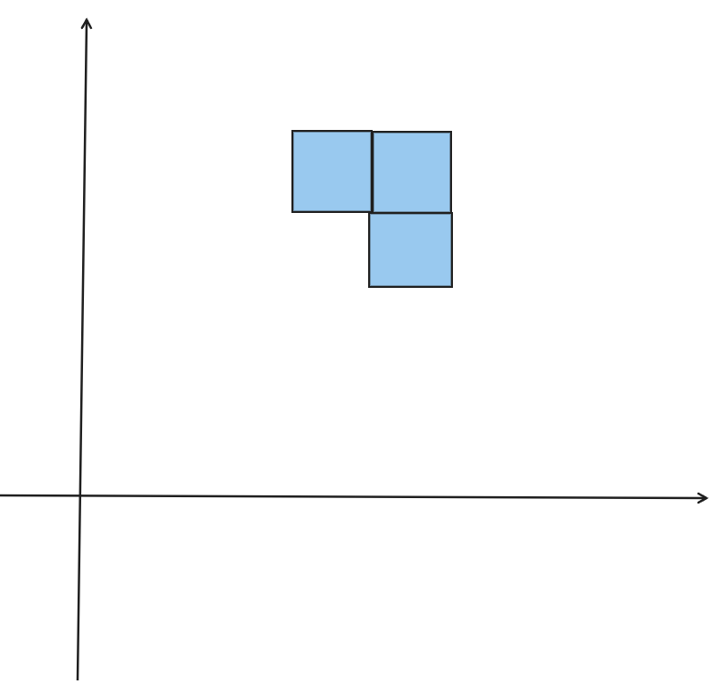
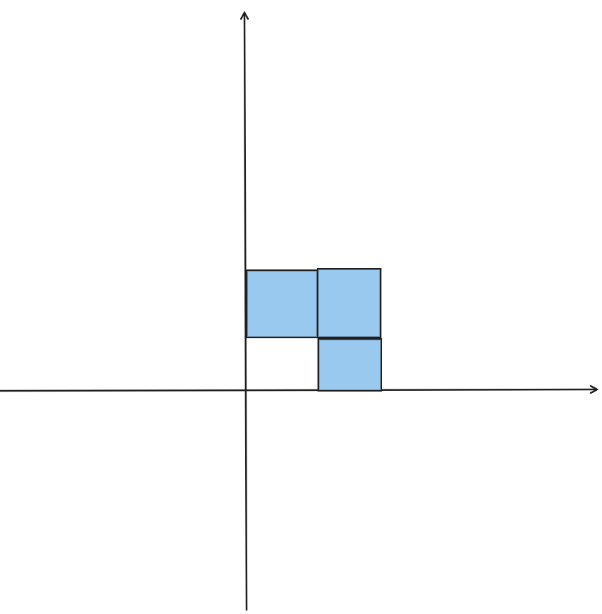

## 前言
有意思的一个方法。
在紫书里面看到了一道题目，书中提到了一个叫做 $Polyomino$ 的方法，发现者是 $Redelmeier$ 。这个方法可以使得在枚举连通块种类的问题中避免枚举后去重，直接生成不会重复的几种连通块。

## 基本思想
对于这多个连通块，我们首先要考虑该如何储存表示他们。
对于连通块的每一块，我们可以都用一个结构体 $Cell$ 来表示，而每个 $Cell$ 都包含了 $x$ 和 $y$ 两个成员用于储存他们的位坐标。那对于整个连通块我们就可以用一个包含了这个连通块的所有 $Cell$ 来表示，以下我们就称这样一个连通块为 $Polyomino$ ，为了寻找指定 $Cell$ 数量的连通块种类，我们可以用一个 $Polyomino$ 集合数组 $poly[n]$ 来储存 $Cell$ 数量为 $n$ 时的 $Polyomino$ 有哪些。
```cpp
#define FOR_CELL(c, p) for (Polyomino::const_iterator c = (p).begin(); c != (p).end(); c++)

struct Cell {
  int x, y;
  Cell(int x = 0, int y = 0) : x(x), y(y) {};
  bool operator<(const Cell& rhs) const {
    return x < rhs.x || (x == rhs.x && y < rhs.y);
  }
};

using Polyomino = std::set<Cell>;

std::set<Polyomino> poly[MAXN + 1];
```
接下来我们需要生成出各种符合要求且不重复的 $Polyomino$ ，其中生成这一步其实并不难，针对问题所要求的这种连通块个数以及大小限制，我们结合 $Polyomino$ 的元素数量和各个 $Cell$ 的坐标就能很快筛选出来，主要的难点就在于如何去重。

### 生成
首先我们先将每个 $Polyomino$ 的第一个方块定义为坐标为 $(0, 0)$ 的 $Cell$ ，然后每次循环生成新的连通块的时候，我们都在前一组连通块的基础上进行生成。比如我们现在要生成元素数量为 $n$ 的连通块，那我们就遍历 $poly[n - 1]$ 中的所有连通块，在他们的基础上向四周各扩散一个块，检查当前的 $Polyomino$ 中是否有了扩散出来的 $Cell$ ，如果没有，再进行处理和插入。
```cpp
void generate() {
  Polyomino s;
  s.insert(Cell(0, 0));
  poly[1].insert(s);

  for (int n = 2; n <= MAXN; n++) {
    for (std::set<Polyomino>::iterator p = poly[n - 1].begin(); p != poly[n - 1].end(); p++)
      FOR_CELL(c, *p)
        for (int dir = 0; dir < 4; dir++) {
          Cell newc(c->x + dx[dir], c->y + dy[dir]);
          if (p->count(newc) == 0) check_polyomino(*p, newc);
        }
  }
}
```

### 处理
接下来就是最核心的步骤，即对我们新生成出来的 $Polyomino$ 进行处理，在这里我们要用到一个标准化的思想，即对所有的的 $Polyomino$ 进行一定的处理，以将其化为一个标准的状态。

我们前面已经知道了，$Polyomino$ 是由一个个带有坐标的 $Cell$ 组成的，而在生成的过程中，也许两个全等的 $Polyomino$ 在坐标平面上的位置并不同，而将他们全部处理成相同的一种形式就是标准化的过程。
```cpp
Polyomino normalize(const Polyomino& p) {
  int minX = p.begin()->x, minY = p.begin()->y;
  FOR_CELL(c, p) {
    minX = std::min(minX, c->x);
    minY = std::min(minY, c->y);
  }
  Polyomino p2;
  FOR_CELL(c, p)
    p2.insert(Cell(c->x - minX, c->y - minY));
  return p2;
}
```
形象化地解释一下，就是把我们当前的这个 $Polyomino$ 平移到第一象限，然后让 $Polyomino$ 最左边和最下边的 $Cell$ 紧贴着 $x$ 和 $y$ 的正半轴。





处理好了位置，接下来就是如何使得旋转和翻转后的 $Polyomino$ 不被计入，首先我们先定义以下 $Polyomino$ 的旋转和翻转这两个过程是怎么完成的。

旋转：顺时针旋转 $90°$ ，也就意味着原本的纵坐标变成了如今的横坐标，而原本的横坐标的相反数变成了如今的纵坐标，所以我们就有
```cpp
Polyomino rotate(const Polyomino& p) {
  Polyomino p2;
  FOR_CELL(c, p)
    p2.insert(Cell(c->y, -c->x));
  return normalize(p2);
}
```
反转：将 $Polyomino$ 上下反转，则横坐标不变，纵坐标变为原来的相反数。
```cpp
Polyomino flip(const Polyomino& p) {
  Polyomino p2;
  FOR_CELL(c, p)
  p2.insert(Cell(c->x, -c->y));
  return normalize(p2);
}
```

接下来就是插入的操作。
我们在插入前，先将 $Polyomino$ 标准化，然后用 $for$ 循环将它旋转 $4$ 次，每次都用 $count()$ 检测集合 $poly[n]$ 里面是否有当前形式的的 $Polyomino$ ，如果有，直接 $return$ 。
如果没有，我们再将 $Polyomino$ 进行反转，再次进行上述操作。当八次操作全都没在集合中查询到一样的 $Polyomino$ 时，我们就可以把它插入到 $poly[n]$ 里面了。
```cpp
void check_polyomino(const Polyomino& p0, const Cell& c) {
  Polyomino p = p0;
  p.insert(c);
  p = normalize(p);

  int n = p.size();
  for (int i = 0; i < 4; i++) {
    if (poly[n].count(p) != 0) return;
    p = rotate(p);
  }
  p = flip(p);
  for (int i = 0; i < 4; i++) {
    if (poly[n].count(p) != 0) return;
    p = rotate(p);
  }
  poly[n].insert(p);
}
```
这就是在生成和插入阶段我们所做的操作，接下来就是统计

### 统计
因为题目要求我们根据 $Polyomino$ 的块数和能容纳下它的矩形的面积进行筛选，因为我们前面对 $Polyomino$ 进行了标准化，所以我们可以找到 $Polyomino$ 的横纵坐标最大值来确定它的“矩形面积”，从而进行筛选。
```cpp
void generate() {
  Polyomino s;
  s.insert(Cell(0, 0));
  poly[1].insert(s);

  for (int n = 2; n <= MAXN; n++) {
    for (std::set<Polyomino>::iterator p = poly[n - 1].begin(); p != poly[n - 1].end(); p++)
      FOR_CELL(c, *p)
        for (int dir = 0; dir < 4; dir++) {
          Cell newc(c->x + dx[dir], c->y + dy[dir]);
          if (p->count(newc) == 0) check_polyomino(*p, newc);
        }
  }

  for (int n = 1; n <= MAXN; n++)
    for (int w = 1; w <= MAXN; w++)
      for (int h = 1; h <= MAXN; h++) {
        int cnt = 0;
        for (std::set<Polyomino>::iterator p = poly[n].begin();
             p != poly[n].end(); p++) {
          int maxX = 0, maxY = 0;
          FOR_CELL(c, *p) {
            maxX = std::max(maxX, c->x);
            maxY = std::max(maxY, c->y);
          }
          if (std::min(maxX, maxY) < std::min(h, w) &&
              std::max(maxX, maxY) < std::max(h, w))
            ++cnt;
        }
        ans[n][w][h] = cnt;
      }
}
```
## 总结
这个方法的特殊点在于它很巧妙地用了一个“标准化”的思想来对 $Polyomino$ 进行处理，从而使得我们的后续处理变得非常方便。