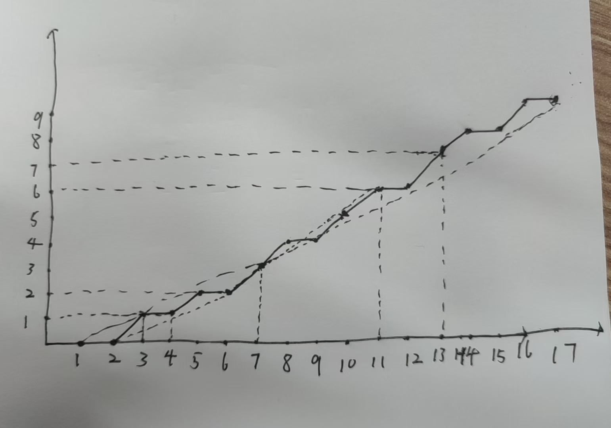
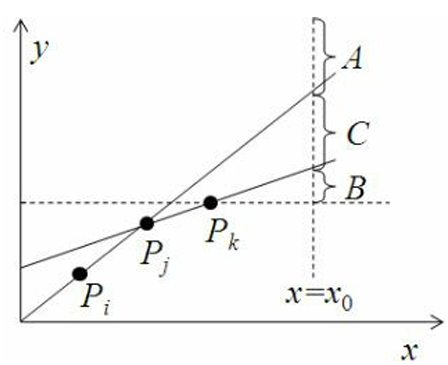
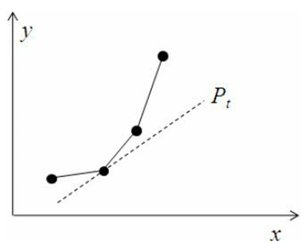

## 题目描述

给定一个长度为 $n$ 的 $01$ 串，选一个长度至少为 $L$  的连续子串，使得子串中数字的平均值最大。如果有多解，子串长度应尽量小；如果仍有多解，起点编号尽量小。序列中的字符编号为 $1$ ~ $n$，因此 $[1,n]$ 就是完整的字符串。$1\le n\le 100000,1\le L\le 1000$。

例如，对于如下长度为 $17$ 的序列`00101011011011010`，如果 $L=7$ ，最大平均值为 $\frac 3 4$ （子序列为 $[7,14]$，其长度为 $8$）；如果 $L=5$，子序列 $[7,11]$ 的平均值最大，为 $\frac 4 5$。

## 输入格式

第一行输入 $T$，表示有 $T$ 组数据。

每组数据的第一行输入两个正整数 $n$ 和 $L$。

每组数据的接下来一行一个长度为 $n$ 的 $01$ 串。

## 输出格式

输出选取的区间的左右端点。

## 输入样例
```
2
17 5
00101011011011010
20 4
11100111100111110000

## 输出样例
```
7 11
6 9
```

## 分析

涉及到区间操作，我们首先想到用前缀和来储存并表示子串的数字之和，我们设前缀和为 $S_n$ ，则可以得到平均值的表达式：

$$
avg_{i,j} = \frac{S_j - S_{i-1}}{j-i+1}
$$

在这里我们要运用数形结合的思想，以字符串的下标 $i$ 在横坐标，$S_i$ 为纵坐标建系，则我们可以得到类似这样的图：



而我们要找到 $avg_{i,j}$  的最大值，即找到这个图像上斜率最大的割线，这时我们可以初步得到一个思路，就是枚举割线的右端点 $t$ ，然后再找到能使割线斜率最大的左端点。但是暴力枚举在数据量较大的时候是会 TLE 的，因此我们需要对目前的方法进行优化。

首先，我们可以剔除那些显然不会使得斜率为最大值的左端点，我们该如何寻找他们？



由上图可知，若我们右端点 $t$ 的横坐标为 $x_0$ ，则它有可能分布在上图的三个区域：$A$ 、$B$ 或 $C$ ，然而

- 在 $A$ 处，$P_kt$ 的斜率显然大于 $P_jt$
- 在 $B$ 处，$P_kt$ 和 $P_it$ 的斜率显然大于 $P_jt$
- 在 $C$ 处，$P_it$ 的斜率显然大于 $P_jt$

所以无论如何 $P_jt$ 的斜率都是最小的。

综上我们可以得出，当图像上存在上凸点时，以它为左端点所得到的割线，它的斜率一定不是最大的，所以我们可以对图像进行预处理，把上凸点全部删掉，由于纵坐标是不递减的，故这个过程我们可以用单调栈来实现。即每往后添加一个新的点，我们都检测新的点与前两个点连线的斜率，如果斜率也是递增的，那么就不存在上凸点，否则我们就把前一个点（即上凸点），从栈中弹出。

预处理之后，我们便可以来从 $L$ 到 $n$ 枚举点 $t$ ，从而找到斜率最大值。

接下来就是第二个优化：对于每个点 $t$ ，我们不必枚举所有待选左端点。



由此图我们可以得知，割线斜率的变化一定是先增后减的，因此我们只需要在斜率开始减小的时候直接 break 就行了。

时间复杂度为 $O(n)$

## 代码
```cpp
#include <bits/stdc++.h>

using i64 = long long;
using u64 = unsigned long long;
using u32 = unsigned;

using pii = std::pair<int, int>;
using pll = std::pair<i64, i64>;

constexpr int maxn = 1e5 + 5;
std::vector<int> a, pre;
int stk[maxn];

int cmp_avg(int x1, int x2, int x3, int x4) {
  return ((pre[x2] - pre[x1 - 1]) * (x4 - x3 + 1) -
          (pre[x4] - pre[x3 - 1]) * (x2 - x1 + 1));
}

void solve() {
  int n, L;
  std::string s;
  std::cin >> n >> L >> s;
  a.resize(n + 1, 0);
  pre.resize(n + 1, 0);
  for (int i = 1; i <= n; i++) a[i] = s[i - 1] - '0';

  std::partial_sum(a.begin(), a.end(), pre.begin());

  pii ans = {1, L};
  int cur = 0, top = 0;
  for (int t = L; t <= n; t++) {
    while (top - cur > 1 && cmp_avg(stk[top - 2], t - L, stk[top - 1], t - L) >= 0) top--;
    stk[top++] = t - L + 1;

    while (top - cur > 1 && cmp_avg(stk[cur], t, stk[cur + 1], t) <= 0) cur++;

    int k = cmp_avg(stk[cur], t, ans.first, ans.second);
    if (k > 0 || (k == 0 && t - stk[cur] < ans.second - ans.first)) {
      ans.first = stk[cur];
      ans.second = t;
    }
  }


  std::cout << ans.first << ' ' << ans.second << "\n";
}

int main() {
  std::ios::sync_with_stdio(false);
  std::cin.tie(nullptr);

  int T;
  std::cin >> T;

  while (T--) {
    solve();
  }

  return 0;
}
```
